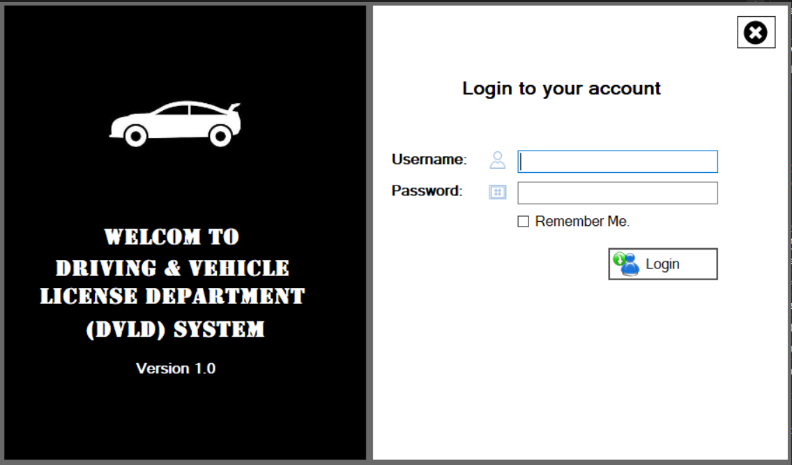
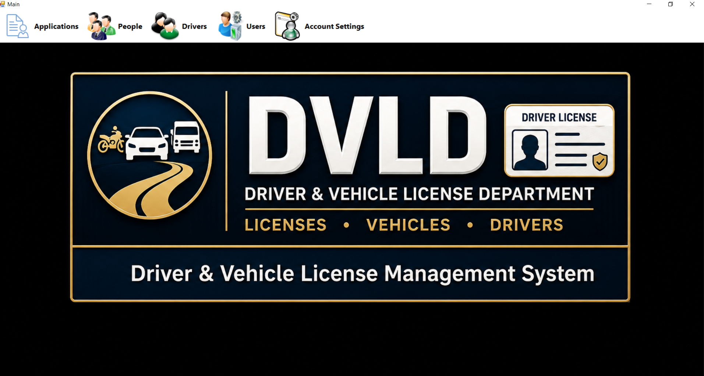
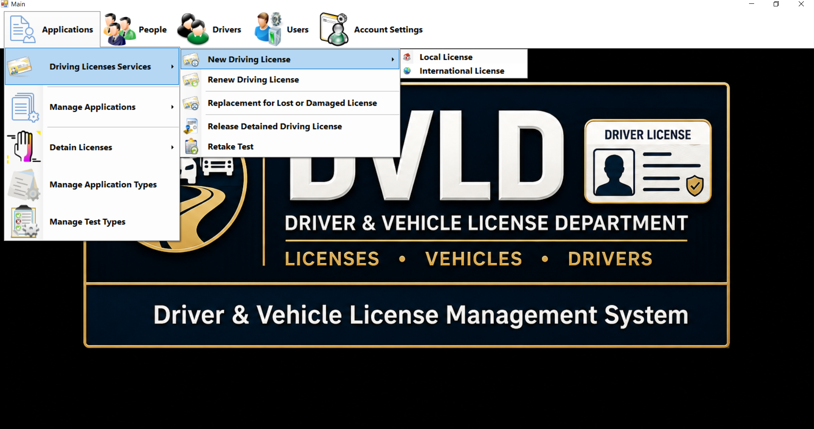
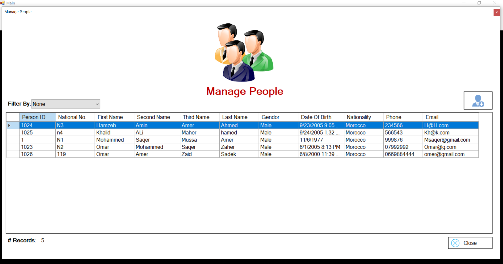
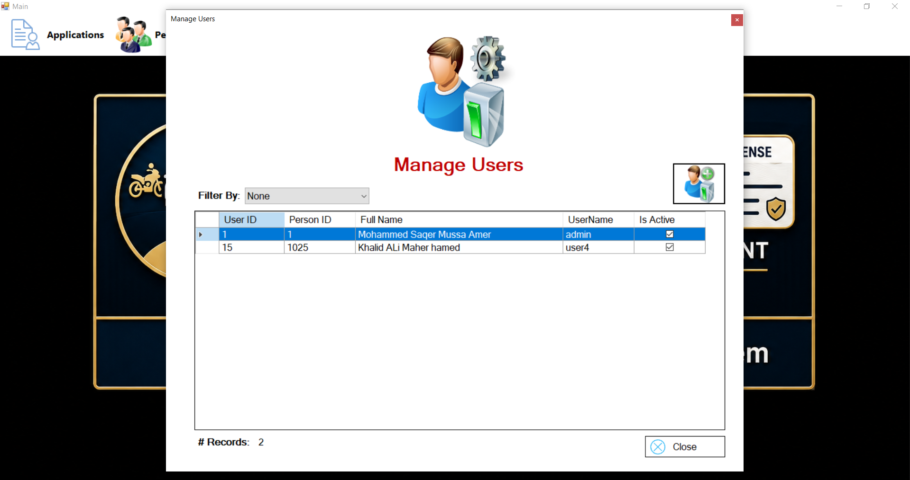
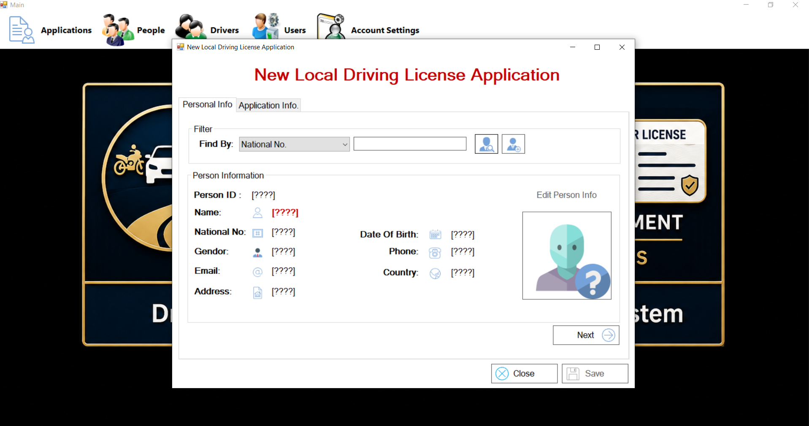
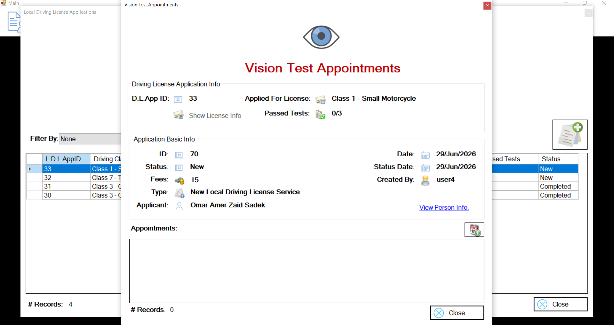
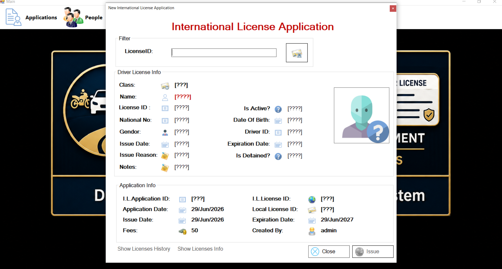
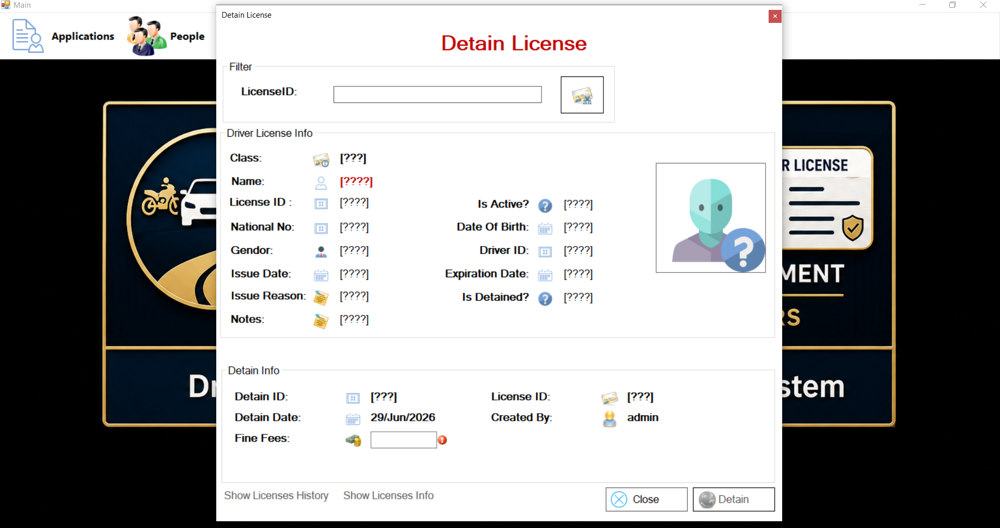

# DVLD - Driving License Management System

DVLD is a C# Windows Forms desktop application that simulates a Driving & Vehicle License Department system. It manages people, users, drivers, driving license applications, tests, local licenses, international licenses, detained licenses, and license-related services.

## Main Features

- People management with national-number based search
- User management and account settings
- Local driving license applications
- International driving license applications
- License renewal
- Replacement for lost or damaged licenses
- Detain and release detained licenses
- Drivers list and license history
- Test appointments and test results
- Application types and test types management

## Technologies Used

- C#
- Windows Forms
- SQL Server
- ADO.NET
- .NET Framework 4.8
- 3-tier architecture

## Project Architecture

The solution is organized into three main projects:

```text
DVLD/              Presentation Layer - Windows Forms UI
DVLD_Buisness/     Business Logic Layer
DVLD_DataAccess/   Data Access Layer - SQL Server / ADO.NET
```

## Solution File

Open the solution from:

```text
DVLD/DVLD.sln
```

## Database Setup

This project requires a SQL Server database named `DVLD`.

The repository includes a database backup file:

```text
database/DVLD_GitHub.bak
```

Before running the application:

1. Restore `database/DVLD_GitHub.bak` in SQL Server Management Studio.
2. Restore it with the database name `DVLD`.
3. Update the connection string in:

```text
DVLD_DataAccess/clsDataAccessSettings.cs
```

Example connection string:

```csharp
public static string ConnectionString = "Server=.;Database=DVLD_GitHub;Integrated Security=True;";
```

## Screenshots











## How to Run

1. Clone the repository.
2. Open `DVLD/DVLD.sln` in Visual Studio.
3. Restore/create the SQL Server database.
4. Update the connection string.
5. Build and run the solution.

## Notes

This project was built as part of a C# desktop development learning path. It focuses on applying Windows Forms, SQL Server, ADO.NET, object-oriented programming, and layered architecture to a realistic business system.
